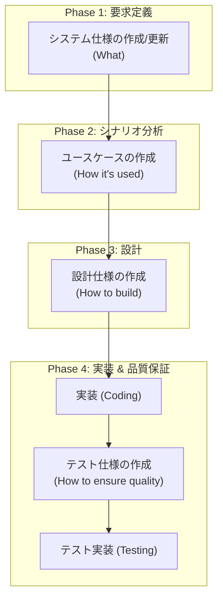

# 1. ドキュメント作成の基本フロー

このドキュメントは、本プロジェクトで新しい機能の開発や既存機能の大きな改修を行う際の、標準的なドキュメント作成フローを定義します。
このフローに従うことで、要求から設計、実装、テストまでの一貫性を保ち、トレーサビリティを確保します。

## 1. 基本的なワークフロー

機能開発は、以下の図に示すように、
**What (何を作るか)** → **How it's used (どう使われるか)** → **How to build (どう作るか)** → **How to ensure quality (どう品質を保証するか)**
という大きな流れで進めます。

## 2. 各フェーズの詳細

### Phase 1: 要求定義 (What)

- **目的:** 開発する機能の目的、範囲、そして満たすべき要件（機能・非機能）を明確に定義します。
- **成果物:** **`01_システム仕様/`** 配下のドキュメント
- **テンプレート:** `テンプレート/01_システム仕様書テンプレート.md`
- **アクション:**
    1. プロダクトマネージャーまたは開発リーダーが、新しい機能に関する**機能要件** (`FUNC-...`) と**非機能要件** (`PERF-...`, `SEC-...`など) をシステム仕様書に追記または新規作成します。
    2. この時点で、各要件に**ユニークな要求ID**を付与します。
    3. チームでレビューを行い、要件に対する合意を形成します。

### Phase 2: シナリオ分析 (How it's used)

- **目的:** 要求定義で固めた機能を、実際のユーザーやシステムの視点でどのように利用されるかの具体的なシナリオに落とし込みます。
- **成果物:** **`02_ユースケース/`** 配下のドキュメント
- **テンプレート:** `テンプレート/02_ユースケーステンプレート.md`
- **アクション:**
    1. 開発者とプロダクトマネージャーが協力し、Phase 1で定義した要件を実現するための具体的なユースケースを作成します。
    2. 基本フロー（成功シナリオ）と代替フロー（例外シナリオ）を明確に記述します。
    3. 各ユースケースが、どの**要求ID**に基づいているかを「関連する機能要件」セクションに明記します。

### Phase 3: 設計 (How to build)

- **目的:** ユースケースを実現するための、技術的な設計図を作成します。
- **成果物:** **`03_設計仕様/`** 配下のドキュメント
- **テンプレート:** `テンプレート/03_設計仕様書テンプレート/` 配下の各種テンプレート
- **アクション:**
    1. 開発者が、アーキテクチャ、API、データモデルなど、必要な設計仕様書を作成します。
        - **どのテンプレートを使うべきか:** プロジェクトの規模や機能の特性に応じて、[設計仕様の書き方ガイド](./04_設計仕様の書き方ガイド.md) を参考に適切なテンプレートを選択します。
    2. 設計がどの**要求ID**や**ユースケースID**を満たすためのものなのかを、「関連する要件」セクションに明記し、トレーサビリティを確保します。

### Phase 4: 実装 & 品質保証 (Implementation & QA)

- **目的:** 設計仕様に基づいて実装を行い、その品質をテストによって保証します。
- **成果物:**
    - ソースコード (`Src/`, `Tests/`)
    - **`06_テスト仕様/`** 配下のドキュメント
- **テンプレート:** `テンプレート/04_テスト仕様書テンプレート/` 配下の各種テンプレート
- **アクション:**
    1. 設計仕様書に基づき、**実装** (`Src/`) と**テストコード** (`Tests/`) の開発に着手します。
    2. 同時に、QAエンジニアまたは開発者が、**テスト仕様書**を作成します。
        - **どのテンプレートを使うべきか:** [テスト仕様の書き方ガイド](./05_テスト仕様の書き方ガイド.md) を参考に、単体・統合・E2Eなど、適切なレベルのテンプレートを選択します。
    3. テスト仕様書には、検証対象の**要求ID**や**ユースケースID**を明記します。
    4. テストコードの実装と実行により、テスト仕様書で定義された全てのケースが満たされていることを確認します。

## 3. ドキュメントの粒度とタイミング

- **ドキュメントは完璧である必要はありません。** 最初に全ての詳細を埋めようとせず、各フェーズで必要なレベルの合意形成ができる粒度で記述し、必要に応じて更新していくことが重要です。
- **小さな変更の場合:**
    - バグ修正やリファクタリングなど、要求や設計に大きな変更がない場合は、必ずしも全てのドキュメントを更新する必要はありません。プルリクエストのDescriptionに、変更内容を明確に記述することを優先してください。
- **迷ったら相談:**
    - どのドキュメントを、どの程度の詳細さで書くべきか迷った場合は、チームのテックリードやリーダーに相談してください。
