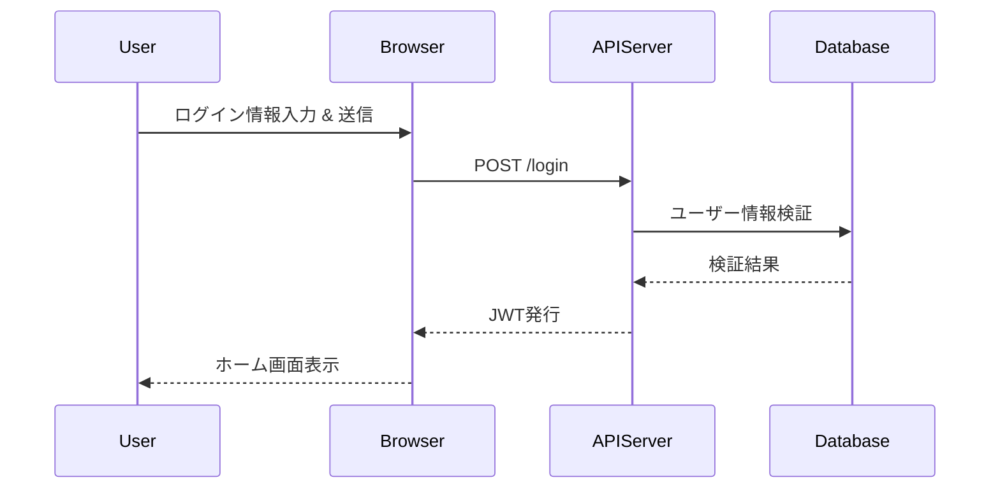

# 4. 設計仕様の書き方ガイド

このドキュメントは、`テンプレート/03_設計仕様書テンプレート/` 配下にある各種テンプレートを使用して、
プロジェクトの技術設計を記述するための具体的な方法とベストプラクティスを解説します。

## 1. 基本的な考え方

設計仕様書は、システム仕様書で定義された「What（何を）」を、**「How to build（どう作るか）」**という技術的な設計図に落とし込むためのドキュメントです。
良い設計仕様書は、実装者が迷うことなく、一貫性があり、保守性の高いコードを書くための明確な指針となります。

- **図を積極的に活用する:** 複雑な構造やフローは、文章だけで説明するよりも、`Mermaid`などを使った図で表現する方が、遥かに直感的で分かりやすくなります。
- **トレース可能に:** この設計が、どの要求やユースケースを実現するためのものなのかを、「関連する要件」セクションで必ず明確にしてください。
- **理由を記述する:** なぜその技術（ライブラリ、アルゴリズム、設計パターン）を選択したのか、その理由やトレードオフを記述することで、将来の変更や保守が容易になります。

## 2. テンプレートの使い分け

プロジェクトの規模や設計対象に応じて、適切なテンプレートを選択してください。必ずしも全てのテンプレートを使う必要はありません。

| テンプレート名                                   | 主な目的                                       | いつ書くか？                           |
| :----------------------------------------------- | :--------------------------------------------- | :------------------------------------- |
| **`01_アーキテクチャテンプレート.md`**           | システム全体の技術的な骨格を定義する           | プロジェクトの初期段階                 |
| **`02_API仕様書テンプレート/`**                  | APIの「契約」を定義する                        | フロント/バック分離開発の前、API実装前 |
| **`03_データモデル設計書テンプレート.md`**       | データの永続化に関する構造を定義する           | DBを扱う機能の実装前                   |
| **`04_コンポーネント設計書テンプレート.md`**     | 複雑なコンポーネントの内部実装を明確にする     | 複雑なビジネスロジックの実装前         |
| **`05_UI設計書テンプレート.md`**                 | ユーザーが触れる画面の設計を定義する           | UIを伴う機能の実装前                   |
| **`06_セキュリティ設計書テンプレート.md`**       | セキュリティ要件の実現方法を定義する           | セキュリティが重要な機能の実装前       |
| **`07_インフラ・デプロイ設計書テンプレート.md`** | アプリを動かす基盤とリリース手順を設計する     | プロジェクト中期、または運用設計時     |
| **`08_監視・運用設計書テンプレート.md`**         | システムの安定稼働のための監視・運用を設計する | 運用設計時                             |

### 小規模プロジェクトやライブラリの場合

- まずは **`01_アーキテクチャテンプレート.md`** で全体の方針を固めます。
- 必要に応じて、**`02_API仕様書テンプレート/02_LIBRARY_API_TEMPLATE.md`** や **`04_コンポーネント設計書テンプレート.md`** を作成します。

### 一般的なWebアプリケーションの場合

- **`01_アーキテクチャテンプレート.md`** で全体像を定義します。
- **`02_API仕様書テンプレート/01_REST_API_TEMPLATE.md`** でバックエンドとフロントエンドの契約を決めます。
- **`03_データモデル設計書テンプレート.md`** でデータベースの設計をします。
- **`05_UI設計書テンプレート.md`** で画面設計を行います。
- その他、必要に応じて他のテンプレートを利用します。

## 3. `Mermaid`による作図の推奨

設計仕様書では、図による視覚的な表現が非常に有効です。テキストベースでバージョン管理も可能な`Mermaid`の利用を強く推奨します。

- **クラス図:** コンポーネント設計に
- **シーケンス図:** APIのフローやコンポーネント間の連携に
- **ER図:** データモデル設計に
- **状態遷移図:** 状態を持つオブジェクトの設計に
- **フローチャート:** 複雑なロジックの可視化に

**例 (シーケンス図):**

