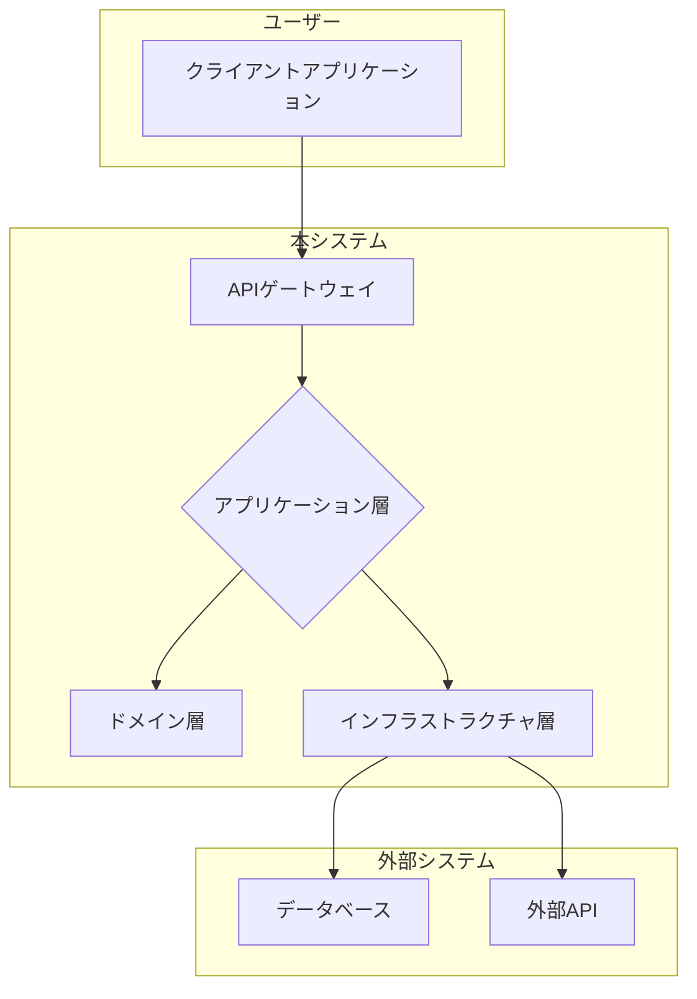

# [章番号]: アーキテクチャ設計書

!!! note "このテンプレートの使い方"
このファイルは、プロジェクト全体の技術的なアーキテクチャを定義するためのテンプレートです。
通常、このドキュメントはプロジェクトの初期段階で作成されます。
詳しい使い方は「[設計仕様の書き方ガイド](ここにガイドへのパスを記述してください)」を参照してください。

## 1. はじめに

### 1.1. 目的

<!-- このドキュメントが定義するアーキテクチャの目的、解決する課題、目指す品質特性（パフォーマンス、スケーラビリティ、保守性など）を記述します。 -->

### 1.2. 対象範囲

<!-- このアーキテクチャが適用されるシステムの範囲を明確にします。 -->

## 2. 設計方針と原則

<!-- このアーキテクチャを設計する上で従う、普遍的な方針や原則をリストアップします。 -->

- **[例: レイヤー化アーキテクチャ]:** 関心の分離を徹底し、各レイヤーは明確な責務を持つ。
- **[例: SOLID原則の適用]:** 保守性と拡張性の高いコードベースを目指す。
- **[例: ドメイン駆動設計の概念適用]:** ビジネスロジックを中心としたモデルを構築する。
- **[例: セキュリティバイデザイン]:** 設計段階からセキュリティを組み込む。

## 3. 全体構成（アーキテクチャ図）

<!-- システムを構成する主要なコンポーネントやレイヤー、およびそれらの関係性を図で示します。Mermaidの利用を強く推奨します。 -->

### 3.1. ハイレベルアーキテクチャ

<!-- システム全体の鳥瞰図。外部システムとの連携なども含みます。 -->

### 3.2. レイヤー構成

<!-- 各レイヤーの役割と責務を簡潔に説明します。 -->

- **UI層:** ユーザーとのインターフェースを担当。
- **アプリケーション層:** ユースケースを実現し、ドメイン層とインフラ層を調整する。
- **ドメイン層:** ビジネスルールとロジックの核心部分。
- **インフラストラクチャ層:** データベースアクセスや外部API連携など、技術的な詳細を実装。

## 4. 技術スタック

<!-- このアーキテクチャを実現するために採用する主要な技術要素を、採用理由とともに記述します。 -->

| 分類               | 技術名     | バージョン | 採用理由                                                   |
| :----------------- | :--------- | :--------- | :--------------------------------------------------------- |
| **言語**           | C#         | 12.0       | 非同期処理に優れ、静的型付けによる堅牢な開発が可能。       |
| **フレームワーク** | .NET       | 8.0        | 高性能かつクロスプラットフォームで動作するため。           |
| **データベース**   | PostgreSQL | 16         | 信頼性が高く、豊富な機能（JSONBなど）を持つため。          |
| **クラウド**       | AWS        | -          | スケーラビリティと豊富なマネージドサービスのため。         |
| **テスト**         | xUnit      | 2.7        | .NETにおけるデファクトスタンダードであり、シンプルなため。 |

## 5. 非機能要件に関する設計

<!-- 主要な非機能要件をどのようにアーキテクチャレベルで実現するかを記述します。 -->

### 5.1. パフォーマンス

<!-- 例: キャッシュ戦略、非同期処理の導入、DBコネクションプーリングなど -->

### 5.2. スケーラビリティ

<!-- 例: ステートレスな設計、マイクロサービス化の方針、オートスケーリング戦略など -->

### 5.3. 可用性・信頼性

<!-- 例: 冗長化構成、フェイルオーバーの仕組み、サーキットブレーカーの導入など -->

### 5.4. 保守性

<!-- 例: モジュール分割の方針、依存関係のルール、CI/CDによる自動化など -->

### 5.5. セキュリティ

<!-- 例: 認証・認可方式の選定、データ暗号化の方針、ネットワーク分離など -->

## 6. 関連する要件

<!-- この設計の根拠となる、システム仕様書で定義された要件IDへのリンクを記載します。 -->

- `[ARCH-XXX-1-0](../01_システム仕様/...)`
- `[PERF-YYY-1-0](../01_システム仕様/...)`
- `[SEC-ZZZ-1-0](../01_システム仕様/...)`
