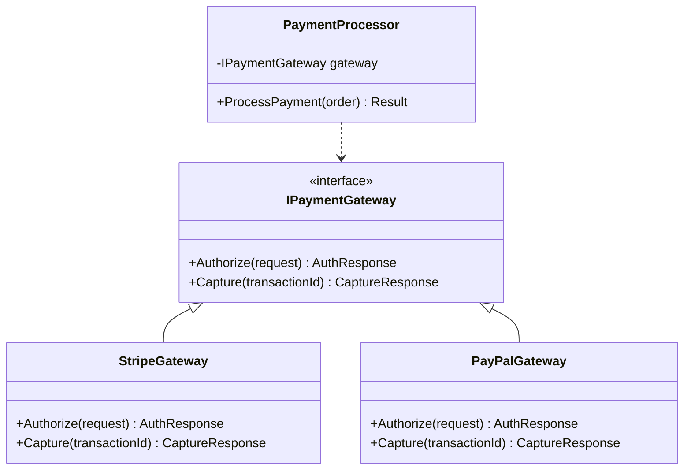
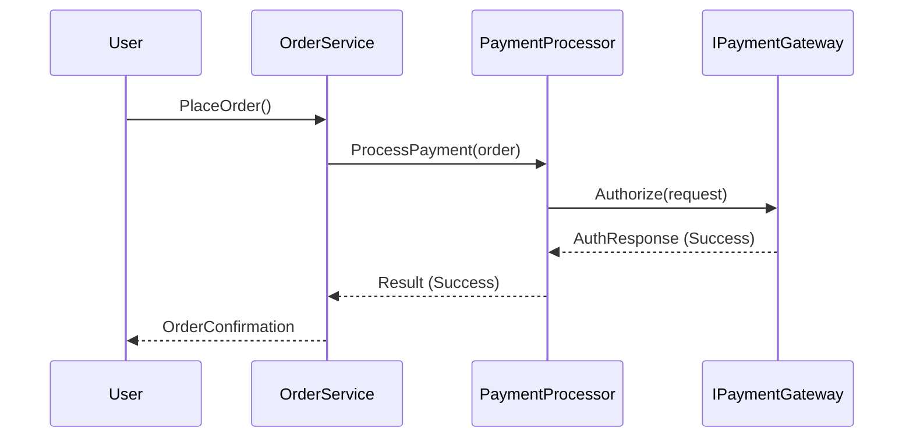
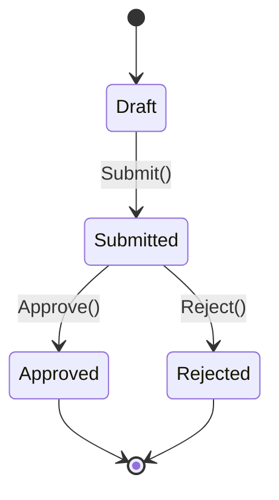

# [章番号]: [コンポーネント名] 設計書

!!! note "このテンプレートの使い方"
このファイルは、特定のコンポーネントやモジュールの詳細な内部設計を定義するためのテンプレートです。
複雑なビジネスロジックやアルゴリズムを実装する前に、このドキュメントで設計を明確にすることを推奨します。
詳しい使い方は「[設計仕様の書き方ガイド](ここにガイドへのパスを記述してください)」を参照してください。

## 1. はじめに

### 1.1. 目的

<!-- このコンポーネントが担う責務と、この設計書が何を定義するのかを記述します。 -->

### 1.2. 背景

<!-- このコンポーネントが必要となった背景や、解決しようとしている課題について説明します。 -->

## 2. コンポーネントの役割と責務

<!-- このコンポーネントがシステム全体の中でどのような役割を果たすのか、その責務の範囲を明確に定義します。 -->

- **[責務1]:** [説明]
- **[責務2]:** [説明]

## 3. クラス図 / モジュール構成図

<!-- コンポーネントを構成する主要なクラス、インターフェース、モジュール間の静的な関係性を図で示します。Mermaidのクラス図が便利です。 -->

## 4. シーケンス図 / フローチャート

<!-- 主要なユースケースにおける、コンポーネント内部の動的な振る舞いや、オブジェクト間のインタラクションを時系列で示します。Mermaidのシーケンス図やフローチャートが役立ちます。 -->

### 4.1. [主要な処理フロー名]

## 5. 主要なアルゴリズムやビジネスロジック

<!-- このコンポーネントで使われる、特に複雑または重要なアルゴリズムやビジネスルールの詳細を記述します。疑似コードや数式、具体的な計算例などを用います。 -->

### 5.1. [アルゴリズム名]

- **目的:** ...
- **ロジック:**
  1. ...
  2. ...

## 6. 状態遷移図

<!-- コンポーネントが状態を持つ場合（ステートマシン）、その状態と遷移の条件を図で示します。Mermaidのステートダイアグラムが適しています。 -->

## 7. 内部API/インターフェース定義

<!-- このコンポーネントが内部的に使用する、または外部モジュールとの連携に使うインターフェースの詳細を定義します。 -->

### `IPaymentGateway` インターフェース

- **概要:** 決済ゲートウェイとの通信を抽象化する。
- **メソッド:**
  - `Task<AuthResponse> Authorize(AuthRequest request)`: 支払い承認をリクエストする。
  - ...

## 8. エラーハンドリング

<!-- このコンポーネント内で発生しうる主要なエラーと、そのハンドリング方針を記述します。 -->

- **[エラーケース1]:** 決済承認の失敗
  - **対応:** `PaymentAuthorizationFailedException` をスローし、注文ステータスを `payment_failed` に更新する。

## 9. 関連する要件

<!-- この設計の根拠となる要件IDへのリンクを記載します。 -->

- `[FUNC-PAY-1-1](../01_システム仕様/...)`
- `[SEC-PCI-1-0](../01_システム仕様/...)`
