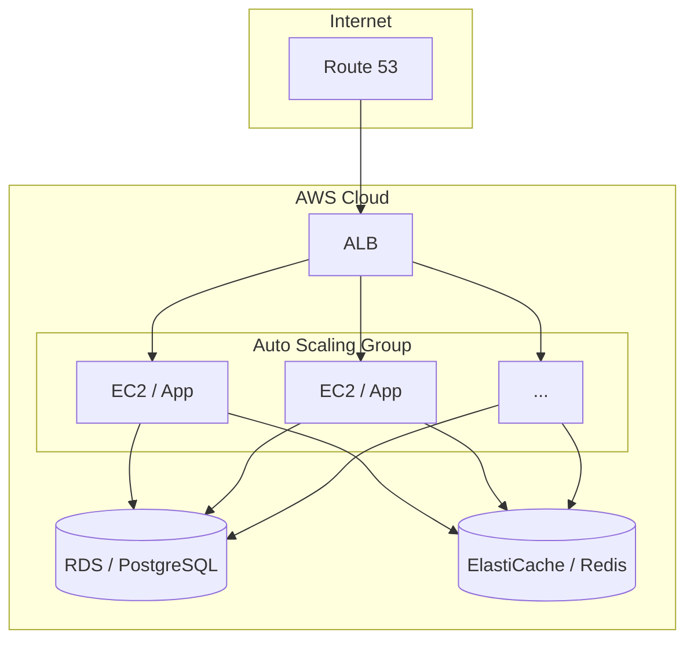
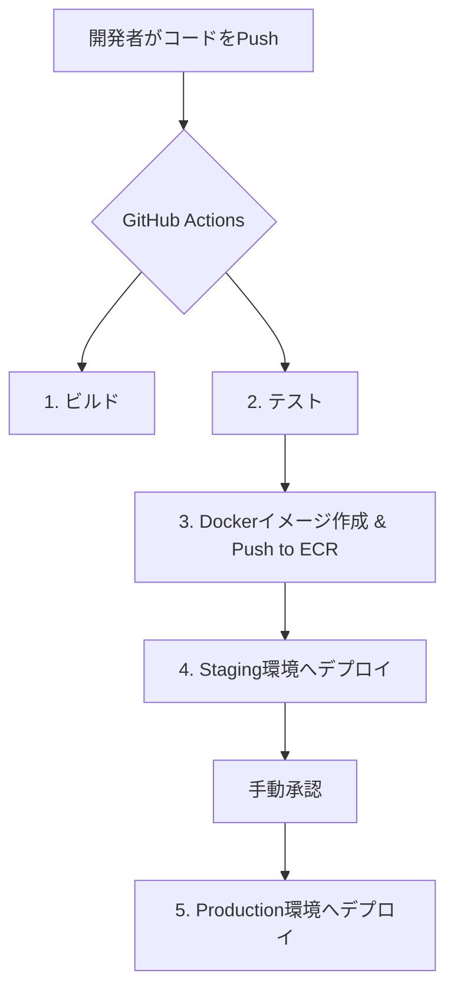

# [章番号]: インフラ・デプロイ設計書

!!! note "このテンプレートの使い方"
このファイルは、アプリケーションを稼働させるためのインフラ構成と、CI/CDパイプラインによるデプロイ戦略を定義するためのテンプレートです。
IaC (Infrastructure as Code) の方針や、デプロイメントフローを明確にします。
詳しい使い方は「[設計仕様の書き方ガイド](ここにガイドへのパスを記述してください)」を参照してください。

## 1. はじめに

### 1.1. 目的

<!-- このドキュメントが定義するインフラとデプロイメント設計の目的を記述します。（例: 高可用性、スケーラビリティ、デプロイの自動化など） -->

## 2. インフラ構成図

<!-- 本番環境、ステージング環境などのインフラ構成を図で示します。クラウドプロバイダーのアーキテクチャ図の形式や、Mermaidを利用します。 -->

### 2.1. 本番環境

### 2.2. ステージング環境

<!-- 本番環境との差異などを記述します。 -->

## 3. インフラストラクチャ管理

<!-- インフラのプロビジョニングと管理方法についての方針を記述します。 -->

- **管理ツール:** Terraform
- **方針:** Infrastructure as Code (IaC) を徹底し、インフラ構成をコードで管理する。手動でのインフラ変更は原則として禁止する。
- **リポジトリ:** [https://github.com/example/infra](https://github.com/example/infra)

## 4. CI/CDパイプライン設計

<!-- コードのコミットから本番環境へのデプロイまでの、継続的インテグレーションと継続的デプロイメントのパイプラインを設計します。 -->

### 4.1. パイプライン全体像

### 4.2. 使用ツール

- **CI/CDプラットフォーム:** GitHub Actions
- **コンテナレジストリ:** Amazon ECR

### 4.3. ブランチ戦略との連携

<!-- Gitのブランチ戦略とCI/CDパイプラインがどのように連携するかを記述します。 -->

- `feature/*` ブランチ: ビルドとテストのみ実行。
- `main` ブランチ: ビルド、テスト後、Staging環境へ自動デプロイ。
- `Gitタグ (v*)`: Stagingでの承認後、Production環境へデプロイ。

## 5. デプロイ戦略

<!-- 本番環境へのリリースを安全に行うための戦略を定義します。 -->

- **戦略名:** Blue/Greenデプロイメント
- **手順:**
  1. 新しいバージョン用の環境（Green）を構築。
  2. Green環境に新しいアプリケーションをデプロイ。
  3. テスト用のトラフィックをGreen環境に流し、動作確認。
  4. 問題がなければ、ロードバランサーでトラフィックを完全にGreen環境に切り替え。
  5. 旧環境（Blue）は一定期間保持し、問題発生時のロールバック先として利用する。

## 6. ロールバック手順

<!-- デプロイ後に問題が発生した場合の、切り戻し手順を定義します。 -->

- **トリガー:**
  - 監視システムでのクリティカルなアラート発報。
  - スモークテストの失敗。
- **手順:**
  1. ロードバランサーのトラフィックを、即座に旧環境（Blue）に切り戻す。
  2. 問題の原因調査を開始する。

## 7. 関連する要件

<!-- この設計の根拠となる要件IDへのリンクを記載します。 -->
<!-- 以下のリンクは例です。実際のファイルパスとセクションIDに更新してください。 -->

- [SEC-AUTH-1-1: 認証フローのセキュリティ要件](../01_システム仕様/03_セキュリティ要件.md#SEC-AUTH-1-1)
- [SEC-DATA-1-0: データ保護のセキュリティ要件](../01_システム仕様/03_セキュリティ要件.md#SEC-DATA-1-0)
- [SEC-LOG-1-0: 監査ログのセキュリティ要件](../01_システム仕様/03_セキュリティ要件.md#SEC-LOG-1-0)
