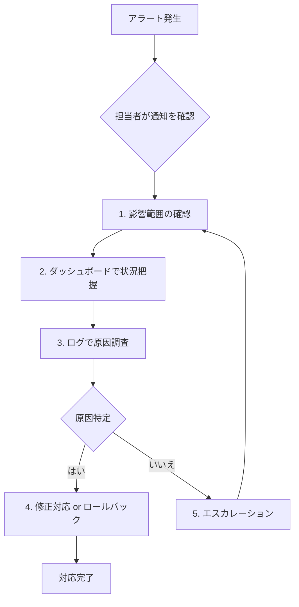

# [章番号]: 監視・運用設計書

!!! note "このテンプレートの使い方"
このファイルは、システムの安定稼働を支えるための監視、ロギング、アラートなどの運用設計を定義するためのテンプレートです。
SRE (Site Reliability Engineering) の観点を取り入れ、SLI/SLOを定義することを推奨します。
詳しい使い方は「[設計仕様の書き方ガイド](ここにガイドへのパスを記述してください)」を参照してください。

## 1. はじめに

### 1.1. 目的

<!-- このドキュメントが定義する監視・運用設計の目的を記述します。（例: 障害の早期発見、迅速な原因特定、SLAの遵守など） -->

## 2. SLI/SLO (サービスレベル指標/目標)

<!-- ユーザー満足度を測るための重要な指標（SLI）と、その目標値（SLO）を定義します。 -->

### 2.1. SLI (Service Level Indicators)

| SLI名          | 計算式                                      | 説明                                          |
| :------------- | :------------------------------------------ | :-------------------------------------------- |
| **可用性**     | `(成功リクエスト数 / 総リクエスト数) * 100` | システムが正常に応答を返した割合。            |
| **レイテンシ** | `95パーセンタイルのAPI応答時間`             | ユーザーリクエストの95%が完了するまでの時間。 |

### 2.2. SLO (Service Level Objectives)

| SLI名          | 目標値      | 期間       |
| :------------- | :---------- | :--------- |
| **可用性**     | `99.9%`     | 過去30日間 |
| **レイテンシ** | `500ms未満` | 過去30日間 |

## 3. ログ設計

<!-- アプリケーションやインフラからどのようなログを収集し、どのように管理するかを設計します。 -->

### 3.1. ログの収集と集約

- **収集対象:**
  - アプリケーションログ (JSON形式)
  - Webサーバーアクセスログ
  - データベースのスロークエリログ
  - OSログ
- **集約ツール:** [例: Fluentd, AWS Kinesis Data Firehose]

### 3.2. ログのフォーマット

<!-- 構造化ログの主要なフィールドを定義します。 -->

- `timestamp`, `level`, `message`, `correlation_id`, `user_id`, `duration_ms`

### 3.3. ログの保管

- **保管場所:** [例: AWS CloudWatch Logs, Elasticsearch]
- **保管期間:** 90日間

## 4. メトリクス監視設計

<!-- システムの状態を定量的に把握するためのメトリクス（測定基準）を設計します。 -->

### 4.1. 監視対象と主要メトリクス

<!-- GoogleのSREが提唱する「4つのゴールデンシグナル」などを参考に、監視対象をリストアップします。 -->

| 対象             | 主要メトリクス                                  |
| :--------------- | :---------------------------------------------- |
| **レイテンシ**   | APIエンドポイントごとの応答時間 (p50, p95, p99) |
| **トラフィック** | リクエスト数/秒 (RPS)                           |
| **エラー**       | HTTP 5xxエラー率, 4xxエラー率                   |
| **飽和度**       | CPU使用率, メモリ使用率, DBコネクション数       |

### 4.2. 監視ツール

- **メトリクス収集:** [例: Prometheus, Datadog Agent]
- **可視化 (ダッシュボード):** [例: Grafana, Datadog]

## 5. アラート設計

<!-- 異常事態を検知し、運用担当者に通知するためのアラートを設計します。 -->

### 5.1. アラート発報条件

<!-- 「いつ」「何を」「どのレベルで」通知するかを定義します。 -->

| アラート名              | 条件                                     | 深刻度   | 通知先           |
| :---------------------- | :--------------------------------------- | :------- | :--------------- |
| **APIエラー率の上昇**   | 5xxエラー率が5分間1%を超えた場合         | Critical | PagerDuty, Slack |
| **APIレイテンシの悪化** | p95応答時間が5分間1秒を超えた場合        | Warning  | Slack            |
| **CPU使用率の高騰**     | CPU使用率が10分間80%を超え続けている場合 | Warning  | Slack            |

### 5.2. 通知ツール

- **アラート管理:** [例: Prometheus Alertmanager, Datadog Monitors]
- **通知先:** [例: PagerDuty, Slack, Email]

## 6. 障害対応フロー

<!-- アラート発生から問題解決までの基本的な対応手順を定義します。 -->

## 7. 関連する要件

<!-- この設計の根拠となる要件IDへのリンクを記載します。 -->

- `[OPS-XXX-1-0](../01_システム仕様/...)`
- `[MAINT-YYY-1-0](../01_システム仕様/...)`
