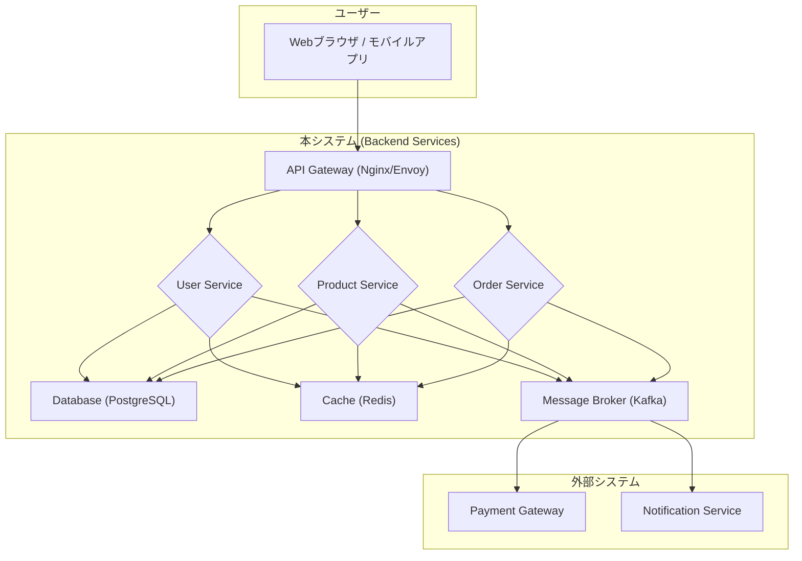

# [章番号]: アーキテクチャ設計書

!!! note "このテンプレートの使い方"

    このファイルは、プロジェクト全体の技術的なアーキテクチャを定義するためのテンプレートです。
    通常、このドキュメントはプロジェクトの初期段階で作成されます。
    詳しい使い方は「[設計仕様の書き方ガイド](../../04_設計仕様の書き方ガイド.md)」を参照してください。

## 1. はじめに

### 1.1. 目的

<!-- このドキュメントが定義するアーキテクチャの目的、解決する課題、目指す品質特性（パフォーマンス、スケーラビリティ、保守性など）を記述します。 -->

### 1.2. 対象範囲

<!-- このアーキテクチャが適用されるシステムの範囲を明確にします。 -->

## 2. 設計方針と原則

<!-- このアーキテクチャを設計する上で従う、普遍的な方針や原則をリストアップします。 -->

- **[例: レイヤー化アーキテクチャ]:** 関心の分離を徹底し、各レイヤーは明確な責務を持つ。
- **[例: SOLID原則の適用]:** 保守性と拡張性の高いコードベースを目指す。
- **[例: ドメイン駆動設計の概念適用]:** ビジネスロジックを中心としたモデルを構築する。
- **[例: セキュリティバイデザイン]:** 設計段階からセキュリティを組み込む。

## 3. 全体構成（アーキテクチャ図）

<!-- システムを構成する主要なコンポーネントやレイヤー、およびそれらの関係性を図で示します。Mermaidの利用を強く推奨します。 -->

### 3.1. ハイレベルアーキテクチャ

<!-- システム全体の鳥瞰図。外部システムとの連携なども含みます。 -->

### 3.2. レイヤー構成

<!-- 各レイヤーの役割と責務を簡潔に説明します。 -->

- **UI層:** ユーザーとのインターフェースを担当。Webブラウザやモバイルアプリなど、クライアントサイドの表示と操作を担う。
- **API Gateway層:** 外部からのリクエストを受け付け、適切なバックエンドサービスにルーティングする。認証・認可、レートリミット、SSL終端などの機能を提供する。
- **アプリケーション層 (サービス層):** ユースケースを実現し、ドメイン層とインフラ層を調整する。トランザクション管理や複数のドメインエンティティにまたがるビジネスロジックを調整する。
- **ドメイン層:** ビジネスルールとロジックの核心部分。ドメインエンティティ、値オブジェクト、ドメインサービス、リポジトリインターフェースなどが含まれる。ビジネスロジックの整合性を保証する。
- **インフラストラクチャ層:** データベースアクセス、外部API連携、メッセージング、キャッシュなど、技術的な詳細を実装する。ドメイン層で定義されたリポジトリインターフェースの実装などが含まれる。

## 4. 技術スタック

<!-- このアーキテクチャを実現するために採用する主要な技術要素を、採用理由とともに記述します。 -->

| 分類               | 技術名     | バージョン | 採用理由                                                   |
| :----------------- | :--------- | :--------- | :--------------------------------------------------------- |
| **言語**           | C#         | 12.0       | 非同期処理に優れ、静的型付けによる堅牢な開発が可能。       |
| **フレームワーク** | .NET       | 8.0        | 高性能かつクロスプラットフォームで動作するため。           |
| **データベース**   | PostgreSQL | 16         | 信頼性が高く、豊富な機能（JSONBなど）を持つため。          |
| **クラウド**       | AWS        | -          | スケーラビリティと豊富なマネージドサービスのため。         |
| **テスト**         | xUnit      | 2.7        | .NETにおけるデファクトスタンダードであり、シンプルなため。 |

## 5. 非機能要件に関する設計

<!-- 主要な非機能要件をどのようにアーキテクチャレベルで実現するかを記述します。 -->

### 5.1. パフォーマンス

<!-- 例: キャッシュ戦略、非同期処理の導入、DBコネクションプーリングなど -->

### 5.2. スケーラビリティ

<!-- 例: ステートレスな設計、マイクロサービス化の方針、オートスケーリング戦略など -->

### 5.3. 可用性・信頼性

<!-- 例: 冗長化構成、フェイルオーバーの仕組み、サーキットブレーカーの導入など -->

### 5.4. 保守性

<!-- 例: モジュール分割の方針、依存関係のルール、CI/CDによる自動化など -->

### 5.5. セキュリティ

<!-- 例: 認証・認可方式の選定、データ暗号化の方針、ネットワーク分離など -->

## 6. 関連する要件

<!-- この設計の根拠となる、システム仕様書で定義された要件IDへのリンクを記載します。 -->
<!-- 以下のリンクは例です。実際のファイルパスとセクションIDに更新してください。 -->

- [SEC-AUTH-1-1: 認証フローのセキュリティ要件](../[仕様書フォルダ]/01_システム仕様書テンプレート.md#SEC-AUTH-1-1)
- [SEC-DATA-1-0: データ保護のセキュリティ要件](../[仕様書フォルダ]/01_システム仕様書テンプレート.md#SEC-DATA-1-0)
- [SEC-LOG-1-0: 監査ログのセキュリティ要件](../[仕様書フォルダ]/01_システム仕様書テンプレート.md#SEC-LOG-1-0)
