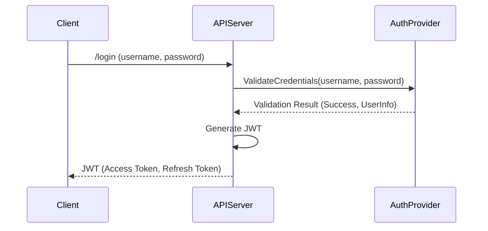

# [章番号]: セキュリティ設計書

!!! note "このテンプレートの使い方"

    このファイルは、システムのセキュリティを確保するための技術的な設計を定義するためのテンプレートです。
    認証・認可、データ保護、監査など、セキュリティに関する実装方針を明確にします。
    詳しい使い方は「[設計仕様の書き方ガイド](../../04_設計仕様の書き方ガイド.md)」を参照してください。

## 1. はじめに

### 1.1. 目的

<!-- このドキュメントが定義するセキュリティ設計の目的と、保護対象となる資産（データ、機能など）を明確にします。 -->

### 1.2. 脅威モデルとリスク分析

<!-- システムが直面する可能性のある脅威を分析し、そのリスクレベルを評価します。STRIDEモデルなどのフレームワークの利用を推奨します。 -->

| 脅威カテゴリ (STRIDE)                 | 具体的な脅威の例                     | 影響度 | 発生可能性 | リスクレベル |
| :------------------------------------ | :----------------------------------- | :----- | :--------- | :----------- |
| **S**poofing (なりすまし)             | 不正なAPIキーによるアクセス          | 高     | 中         | 高           |
| **T**ampering (改ざん)                | DB内のデータ直接改ざん               | 高     | 低         | 中           |
| **R**epudiation (否認)                | ログを削除し操作を否認               | 中     | 低         | 低           |
| **I**nformation Disclosure (情報漏洩) | 暗号化されていないデータへのアクセス | 高     | 中         | 高           |
| **D**enial of Service (サービス拒否)  | 大量リクエストによるAPI停止          | 中     | 高         | 高           |
| **E**levation of Privilege (権限昇格) | 一般ユーザーが管理者権限を奪取       | 高     | 低         | 中           |

## 2. 認証 (Authentication) 設計

<!-- ユーザーやシステムが「誰であるか」を証明するための仕組みを設計します。 -->

### 2.1. 認証フロー

<!-- ログインやAPIアクセスの認証フローを図で示します。 -->

### 2.2. 認証方式

<!-- 採用する認証方式（ID/パスワード、OAuth 2.0, JWT, mTLSなど）とその設定詳細を記述します。 -->

- **方式:** JWT (JSON Web Token)
- **アルゴリズム:** RS256
- **有効期間:** アクセストークン: 15分, リフレッシュトークン: 30日

## 3. 認可 (Authorization) 設計

<!-- 認証された主体が「何をしてよいか」を制御する仕組みを設計します。 -->

### 3.1. アクセス制御モデル

<!-- 採用するアクセス制御モデル（RBAC, ABACなど）を記述します。 -->

- **モデル:** ロールベースアクセスコントロール (RBAC)

### 3.2. ロールと権限

<!-- 主要なロールと、各ロールに割り当てられる権限を定義します。 -->

| ロール   | 権限                                                         | 説明                             |
| :------- | :----------------------------------------------------------- | :------------------------------- |
| `admin`  | `posts:create`, `posts:read`, `posts:update`, `posts:delete` | 全ての投稿を管理できる。         |
| `editor` | `posts:create`, `posts:read`, `posts:update`                 | 自身が作成した投稿を編集できる。 |
| `viewer` | `posts:read`                                                 | 全ての投稿を閲覧できる。         |

## 4. データ保護設計

<!-- データの機密性と完全性を保護するための設計を記述します。 -->

### 4.1. 保存時の暗号化 (Encryption at Rest)

- **対象データ:** `users.email`, `secrets.api_key`
- **暗号化アルゴリズム:** AES-256-GCM
- **鍵管理:** AWS KMS (Key Management Service) を利用。

### 4.2. 転送時の暗号化 (Encryption in Transit)

- **プロトコル:** TLS 1.2以上を必須とする。
- **証明書管理:** AWS Certificate Manager (ACM) を利用。

## 5. 監査ログ設計

<!-- セキュリティに関連するイベントを記録するための設計を記述します。 -->

### 5.1. 記録対象イベント

- ログイン成功・失敗
- パスワード変更
- 重要なデータへのアクセス・変更
- 権限の変更

### 5.2. ログフォーマットと保管

- **フォーマット:** JSON形式
- **保管場所:** AWS CloudWatch Logs
- **保管期間:** 1年間

## 6. 脆弱性対策

<!-- OWASP Top 10などの一般的な脆弱性に対する具体的な対策方針を記述します。 -->

- **SQLインジェクション:** 全てのDBクエリでプリペアドステートメントを使用する。
- **クロスサイトスクリプティング (XSS):** 全てのユーザー入力をエスケープ処理し、Content Security Policy (CSP) を導入する。

## 7. 関連する要件

<!-- この設計の根拠となるセキュリティ要件IDへのリンクを記載します。 -->
<!-- 以下のリンクは例です。実際のファイルパスとセクションIDに更新してください。 -->

- [SEC-AUTH-1-1: 認証フローのセキュリティ要件](../[仕様書フォルダ]/01_システム仕様書テンプレート.md#SEC-AUTH-1-1)
- [SEC-DATA-1-0: データ保護のセキュリティ要件](../[仕様書フォルダ]/01_システム仕様書テンプレート.md#SEC-DATA-1-0)
- [SEC-LOG-1-0: 監査ログのセキュリティ要件](../[仕様書フォルダ]/01_システム仕様書テンプレート.md#SEC-LOG-1-0)
