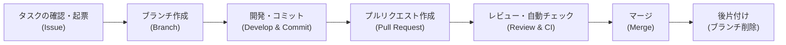

# 01.開発フロー概要

このドキュメントでは、本プロジェクトにおける基本的な開発作業の流れ（ワークフロー）を説明します。
全ての開発作業は、このフローに沿って行われます。

!!! info "このドキュメントのスコープ"
    このフローは、新機能開発や通常のバグ修正といった、**計画的な開発作業**の基本的な流れを示します。
    緊急の修正（Hotfix）や製品リリースについては、それぞれ**[05.ブランチ規定](./05_ブランチ規定.md)**および**[05.リリース規定](../05_リリース規定/README.md)**を参照してください。

## 開発フローの全体像

----

1. **タスクの確認と起票 (Issue):**
    - 開発に着手する前に、対応するタスクが**GitHub Issue**として起票されていることを確認します。なければ、まずIssueを作成します。
    - 詳細は **[04.Issue規定](./04_Issue規定.md)** を参照してください。

2. **ブランチの作成 (Branch):**
    - 開発ブランチである`main`から、作業内容に応じた名前のブランチを作成します。
    - 詳細は **[05.ブランチ規定](./05_ブランチ規定.md)** を参照してください。

3. **開発とコミット (Develop & Commit):**
    - ローカル環境で開発を行い、意味のある単位でコミットします。
    - コミットメッセージの書き方については、ブランチ規定の中で定義します。

4. **プルリクエストの作成 (Pull Request):**
    - 作業が完了したら、作業ブランチをGitHubにプッシュし、`main`ブランチへの**プルリクエスト(PR)**を作成します。
    - 詳細は **[06.プルリクエスト規定](./06_プルリクエスト規定.md)** を参照してください。

5. **レビューと自動チェック (Review & CI):**
    - PRが作成されると、GitHub Actionsによる自動チェックが実行されます。
    - 同時に、他の開発者によるコードレビューが行われます。

6. **マージ (Merge):**
    - 全ての自動チェックが成功し、レビューで承認されたら、PRを開発ブランチである**`main`ブランチ**にマージします。

7. **後片付け:**
    - マージ後、不要になった作業ブランチを削除します。
