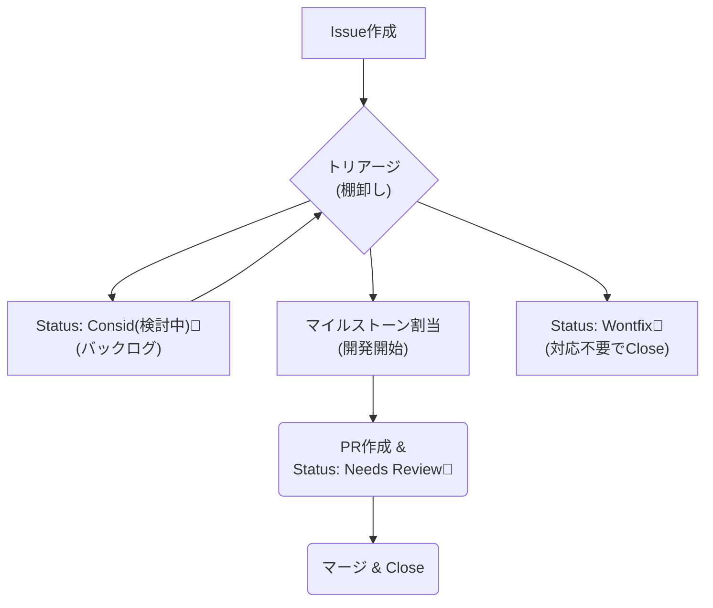

# 04.Issue規定

このドキュメントは、GitHub Issueの作成と運用に関する、より詳細なルールを定めます。
Issueは、全ての開発作業の起点となり、仕様を定義し、進捗を追跡するための中心的なツールです。

---

## 1. Issue起票の基本原則

*   **全ての作業はIssueから:**
    *   機能開発、バグ修正、ドキュメント作成、調査など、全ての作業はIssueを起点とします。
*   **まずタイトルで起票:**
    *   思いついたタスクは、忘れる前にまずタイトルだけでも良いのでIssueとして起票する習慣を推奨します。詳細は後から追記・編集できます。

---

## 2. Issueの書き方

### 2.1. タイトル
*   Issueの内容が具体的で、一目で理解できるように記述します。
    *   **悪い例:** `バグを修正`
    *   **良い例:** `ログイン画面でパスワードを50文字以上入力するとクラッシュする`

### 2.2. 本文 (Description)
*   **Issueテンプレート**の利用を強く推奨します。テンプレートはリポジトリの`.github/ISSUE_TEMPLATE/`フォルダに配置されています。
*   **バグ報告の場合:** 「再現手順」「期待される動作」「実際の動作」を記述します。
*   **機能提案の場合:** 「どのような機能か（What）」「なぜ必要か（Why）」を記述します。
*   **タスクの場合:** 具体的な「やることリスト（チェックボックス形式）」を記述します。

---

## 3. Issueのライフサイクルと仕様の確定フロー

Issueは「起票」→「議論・仕様確定」→「実装」→「完了」というライフサイクルを辿ります。この状態管理は、主に**ラベル**と**マイルストーン**によって行われます。



### 3.1. 議論と仕様検討 (コメント欄の活用)
*   起票されたIssueの内容について、実装方法のアイデア、懸念点、仕様の曖昧な部分などに関する議論は、全て**コメント欄**で行います。
*   これにより、最終的な仕様に至るまでの思考プロセスや、検討された代替案などの**全ての文脈が記録として残ります。**

### 3.2. 仕様の確定と本文への反映
*   コメント欄での議論が収束し、実装すべき内容が固まったら、Issueの担当者（または議論の進行役）は、その**最終決定事項をIssueの本文（Description）にまとめます。**
*   **本文は、常に「今、実装すべき最新の仕様」**が記述されている状態を保ちます。
*   具体的な「やることリスト」は、以下のようにチェックボックス形式で記述することを強く推奨します。

    ```markdown
    ---
    ### 最終仕様 (Final Specification)
    
    #### 概要
    ユーザーが自身のプロフィール画像をアップロードできるようにする。
    
    #### やること (TODO)
    - [ ] **API:** プロフィール画像を受け取る `POST /api/v1/users/me/avatar` エンドポイントを作成する。
    - [ ] **Validation:** アップロードされるファイルは、JPEGまたはPNG形式で、サイズは5MB未満であること。
    - [ ] **Backend:** 受け取った画像をリサイズし、指定のストレージに保存するロジックを実装する。
    - [ ] **Frontend:** プロフィール設定画面に、ファイル選択ボタンとアップロードボタンを実装する。
    ```

### 3.3. バックログ管理と棚卸し (Triage)
*   新しく作成されたIssueや、すぐに対応方針を決められないIssueには、**`"Status: Consid(検討中)🤔"`** ラベルを付与します。このラベルが付いたIssueが、プロジェクトの「バックログ」となります。
*   定期的に（週一回など）、バックログにあるIssue一覧を確認し、次のアクションを決定します。
    *   **対応する場合:** `"Status: Consid(検討中)🤔"`ラベルを削除し、適切な**マイルストーン**を割り当て、開発を開始します。
    *   **対応しない場合:** `"Status: Wontfix🤷"`ラベルを付与し、理由をコメントしてIssueをクローズします。

### 3.4. AIアシスタントとの連携
*   **AIへの指示:**
    *   GeminiやCopilotに実装を依頼する際は、「`#123`を実装してください」のように、Issue番号を伝えます。
    *   AIは、そのIssueの**本文**を読み込み、「最終仕様」と「やることリスト」に基づいて、コード生成やテスト作成を行います。
*   **AIの出力:**
    *   AIが生成したコードや設計案に対する議論も、コメント欄で行います。採用が決まったら、その内容もIssueの本文に反映させます。

!!! success "このフローのメリット"
    - **文脈の保存:** なぜその仕様になったのか、という議論の過程がコメント欄に残る。
    - **仕様の明確化:** Issueの本文を見れば、常に最新の「やるべきこと」が明確にわかる。
    - **AIとのスムーズな連携:** AIに、ノイズ（議論の途中経過）を含まない、クリーンな仕様書だけをインプットとして与えることができる。
