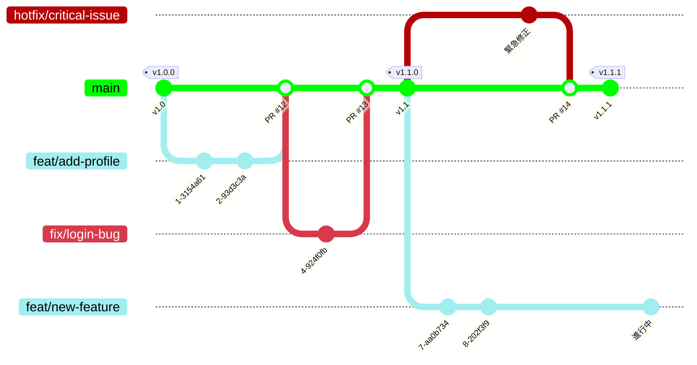

# 05.ブランチ規定

このドキュメントでは、Gitのブランチ戦略と、各ブランチの命名規則および運用ルールについて定めます。
一貫したブランチ戦略は、複数人での並行開発を可能にし、変更履歴の追跡を容易にします。

---

## 1. ブランチ戦略の全体像

本プロジェクトでは、シンプルで柔軟な **GitHub Flow** をベースとし、緊急のバグ修正に対応するための**Hotfixフロー**を組み合わせた戦略を採用します。

*   全ての開発は、`main`ブランチから作成された**作業ブランチ**（`feat/`, `fix/`など）で行われます。
*   作業が完了したブランチは、**プルリクエスト**を通じて`main`ブランチにマージされます。
*   緊急性の高いバグ修正は、`hotfix/`ブランチを使って、計画外のリリースを行います。

---

## 2. ブランチの種類と命名規則

### 2.1. main ブランチ
*   **役割:** 常に安定し、リリース可能な状態を保つ、プロジェクトの主軸となるブランチ。
*   **運用:** 直接のプッシュは禁止。全ての変更はプルリクエスト経由で行います。

### 2.2. 作業ブランチ

作業の種類に応じて、以下のプレフィックスを付けたブランチを作成します。
ブランチのプレフィックスは、対応するIssueやPRに付与される **`Type:` ラベルと連動**します。

| ブランチプレフィックス | 対応するラベル (`Type:`) | 目的 | 命名規則例 |
| :--- | :--- | :--- | :--- |
| `feat/` | `Feature(機能)` | 新機能の追加・拡張 | `feat/12-add-login-function` |
| `fix/` | `Bug(不具合)` | **通常**のバグ修正 | `fix/42-resolve-display-error` |
| `refactor/` | `Refact(改善)` | リファクタリング、既存機能の改善 | `refactor/61-optimize-query` |
| `docs/` | `Doc(ドキュメント)` | ドキュメントの作成・修正 | `docs/92-update-api-spec` |
| `chore/` | `Chore(設定)` | ビルド設定、CI改善などの雑務 | `chore/101-update-ci-settings` |

### 2.3. ホットフィックスブランチ (`hotfix/`)
*   **目的:** `Priority: Critical🔥`と判断されたバグに、緊急で対応するための専用ブランチです。
*   **対応ラベル:** `Type: Bug(不具合)`
*   **運用フロー:**
    1.  最新の`main`ブランチ（または安定版を示すGitタグ）から、`hotfix/[Issue番号]-[概要]`という名前でブランチを作成します。
    2.  修正作業を行い、コミットします。
    3.  `main`ブランチへのプルリクエストを作成し、レビューを経て**最優先でマージ**します。
    4.  マージ後、`main`ブランチに新しい**パッチバージョン**（例: `v1.1.1`）のGitタグを打ち、即座にリリースを行います。---

## 3. コミットメッセージの指針

*   **プレフィックスの活用:** コミットメッセージのタイトルには、**Conventional Commits**に準じたプレフィックス（`feat:`, `fix:`, `docs:`など）を付けることを推奨します。
*   **関連Issueの記述:** 本文に`Closes #[Issue番号]`を記述することで、PRがマージされた際に自動でIssueをクローズできます。
