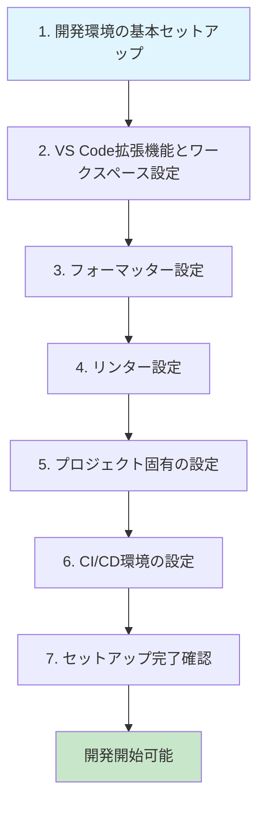

# 00 セットアップガイド

このセクションでは、DevBlueprint プロジェクトの開発環境を構築するための、包括的なセットアップ手順を提供します。
新規参加者やチームメンバーは、このガイドに従って環境を構築することで、統一された開発環境での作業が可能になります。

## セットアップ手順の流れ

開発環境のセットアップは、以下の順序で行うことを推奨します：

## セットアップドキュメント一覧

### 必須セットアップ

以下のドキュメントは、**全ての開発者が実施必須**の環境構築手順です。

- **[01\_開発環境の基本セットアップ.md](./01_開発環境の基本セットアップ.md)**
    - Node.js、npm、Git、VS Code の基本インストールと設定
    - 開発に必要な最低限のツールチェーンを整備

- **[02_VSCode拡張機能とワークスペース設定.md](./02_VSCode拡張機能とワークスペース設定.md)**
    - 必須/推奨拡張機能のインストール
    - ワークスペース設定（settings.json、tasks.json）の適用

- **[03\_フォーマッター設定.md](./03_フォーマッター設定.md)**
    - Prettier（コードフォーマッター）の設定
    - EditorConfig（エディタ統一設定）の適用
    - 保存時自動フォーマットの有効化

- **[04\_リンター設定.md](./04_リンター設定.md)**
    - ESLint（JavaScript/TypeScript構文チェック）の設定
    - markdownlint（Markdown文法チェック）の設定
    - VS Code でのエラー表示設定

### 追加セットアップ

プロジェクトの理解を深め、効率的な開発を行うための追加設定です。

- **[05\_プロジェクト固有の設定.md](./05_プロジェクト固有の設定.md)**
    - package.json スクリプトの説明
    - 各種設定ファイル（.eslintrc、.prettierrc等）の詳細解説
    - tsconfig.json、jest.config.js 等の設定内容

- **[06_CI_CD環境の設定.md](./06_CI_CD環境の設定.md)**
    - GitHub Actions ワークフローの理解
    - Husky（pre-commit hooks）の動作確認
    - 自動化されたチェック項目の説明

### トラブルシューティング

- **[07\_トラブルシューティング.md](./07_トラブルシューティング.md)**
    - よくあるエラーメッセージと解決方法
    - 環境固有の問題への対応
    - パフォーマンス改善のヒント

## セットアップ完了チェックリスト

全てのセットアップが完了したら、以下の項目を確認してください：

### 基本環境

- [ ] Node.js がインストールされ、`node --version` でバージョンが表示される
- [ ] npm が動作し、`npm --version` でバージョンが表示される
- [ ] Git が設定され、`git --version` でバージョンが表示される
- [ ] VS Code が起動し、プロジェクトフォルダを開ける

### VS Code 環境

- [ ] 必須拡張機能がすべてインストール済み
- [ ] ワークスペース設定が適用され、コード補完が動作する
- [ ] 問題パネルでリンターエラーが表示される
- [ ] 保存時に自動フォーマットが動作する

### プロジェクト環境

- [ ] `npm install` でパッケージがインストールできる
- [ ] `npm run lint` でリンターが実行される
- [ ] `npm run format` でフォーマッターが実行される
- [ ] `npm test` でテストが実行される（該当する場合）

### 統合環境

- [ ] Git commit 時に pre-commit hooks が動作する
- [ ] コードをプッシュ時に GitHub Actions が動作する
- [ ] ドキュメントサイトが正常にビルドされる

## サポートとヘルプ

セットアップ中に問題が発生した場合：

1. **まず確認**: [07\_トラブルシューティング.md](./07_トラブルシューティング.md) で該当する問題がないか確認
2. **チーム内相談**: Slack やチームチャットで他のメンバーに相談
3. **Issue作成**: 解決しない場合は GitHub Issue で詳細を報告

---

**重要**: このセットアップガイドは、プロジェクトの成長に合わせて継続的に更新されます。定期的に最新版を確認し、環境を最新の状態に保ってください。
