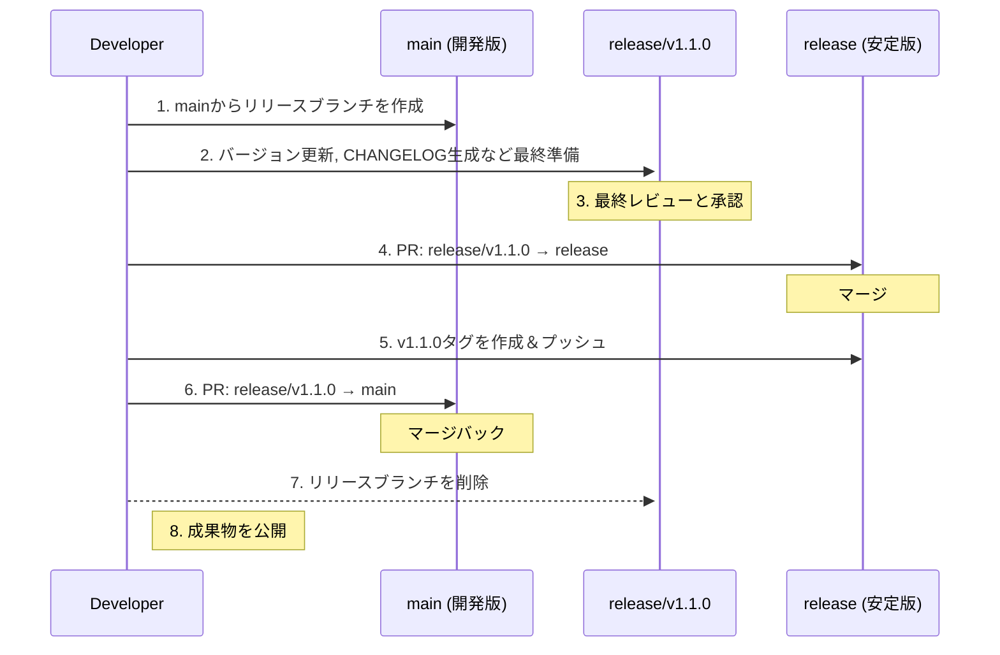

# 02. リリースプロセス

このドキュメントは、開発された成果物を新しいバージョンとしてリリースするための、具体的な手順（ワークフロー）を定めます。このプロセスに従うことで、誰でも安全で一貫性のあるリリース作業を実施できます。

## 1. リリースの種類

リリースは、大きく分けて2種類あります。

- **計画的リリース (メジャー / マイナー):**
  - `main`ブランチで開発された新機能群を、計画的にリリースします。このドキュメントでは、主にこのプロセスについて詳述します。
- **Hotfixリリース (パッチ):**
  - `release`ブランチで発見された緊急のバグを修正するための、計画外のリリースです。基本的な流れは**[05\_ブランチ規定](../02_プロジェクト規定/05_ブランチ規定.md)**で定義されていますが、このドキュメントの関連ステップも適用されます。

## 2. 計画的リリースのプロセス

計画的なリリースは、以下のステップで慎重に行います。



### Step 1: リリースブランチの作成

- `main`ブランチの最新の状態から、リリース作業専用のブランチを作成します。
- **命名規則:** `release/v[バージョン番号]` (例: `release/v1.1.0`)

  ```bash
  git checkout main
  git pull origin main
  git checkout -b release/v1.1.0
  git push origin release/v1.1.0
  ```

### Step 2: リリースブランチでの最終準備

リリースブランチ上では、リリースに直接関連する作業のみを行います。

1. **バージョン番号の更新:**
   - **[01\_バージョン管理規定](./01_バージョン管理規定.md)**に従い、プロジェクトのバージョン番号を確定させます。（例: `.csproj`や`package.json`のバージョンを`1.1.0`に更新）
2. **変更履歴 (CHANGELOG) の生成:**
   - **[03\_変更履歴の管理.md](./03_変更履歴の管理.md)**で定義されたツールを使い、`CHANGELOG.md`を更新します。
3. **ドキュメントの更新:**
   - READMEやAPI仕様書など、今回のリリース内容に関連するドキュメントを最終確認し、必要であれば更新します。
4. **コミット:**
   - 上記の変更を、一つのコミットにまとめてプッシュします。
   - **コミットメッセージ例:** `chore(release): prepare for v1.1.0`

### Step 3: 最終レビューと承認

- リリースブランチ（`release/v1.1.0`）から、`release`ブランチと`main`ブランチの両方に対するプルリクエストを作成し、**ドラフト状態**にしておきます。
- このリリースブランチを使い、ステージング環境などで最終的な動作確認や受け入れテストを実施します。
- 全てのテストが完了し、リリースしても問題ないと判断されたら、関係者から承認を得ます。

### Step 4: `release`ブランチへのマージ（安定版の更新）

- `release/v1.1.0` → `release` へのプルリクエストをレビューし、マージします。
- **マージ方法:** `main`ブランチとは異なり、こちらは通常の`Merge commit`を推奨します。これにより、「バージョン`v1.1.0`のリリース」という事実がマージコミットとして明確に履歴に残ります。

### Step 5: Gitタグの作成とプッシュ

- `release`ブランチにマージされた直後のコミットに対して、バージョンタグを付与し、リモートリポジトリにプッシュします。

  ```bash
  git checkout release
  git pull origin release
  git tag -a v1.1.0 -m "Release version 1.1.0"
  git push origin v1.1.0
  ```

### Step 6: `main`ブランチへのマージバック

- `release/v1.1.0` → `main` へのプルリクエストをレビューし、マージします。
- これにより、バージョン番号の更新や`CHANGELOG.md`の内容が、開発ブランチにも反映されます。

### Step 7: リリースブランチの削除

- 両方のブランチへのマージが完了したら、役目を終えたリリースブランチ（`release/v1.1.0`）を削除します。

### Step 8: 成果物の公開

- Gitタグの作成をトリガーとして、CI/CDパイプラインが自動的に成果物（パッケージ、Dockerイメージなど）をビルドし、適切な場所（NuGet, Docker Hub, etc.）に公開します。
- **[04\_リリースノートの作成.md](./04_リリースノートの作成.md)**に従い、GitHub Releasesなどでユーザー向けのリリースノートを公開します。
