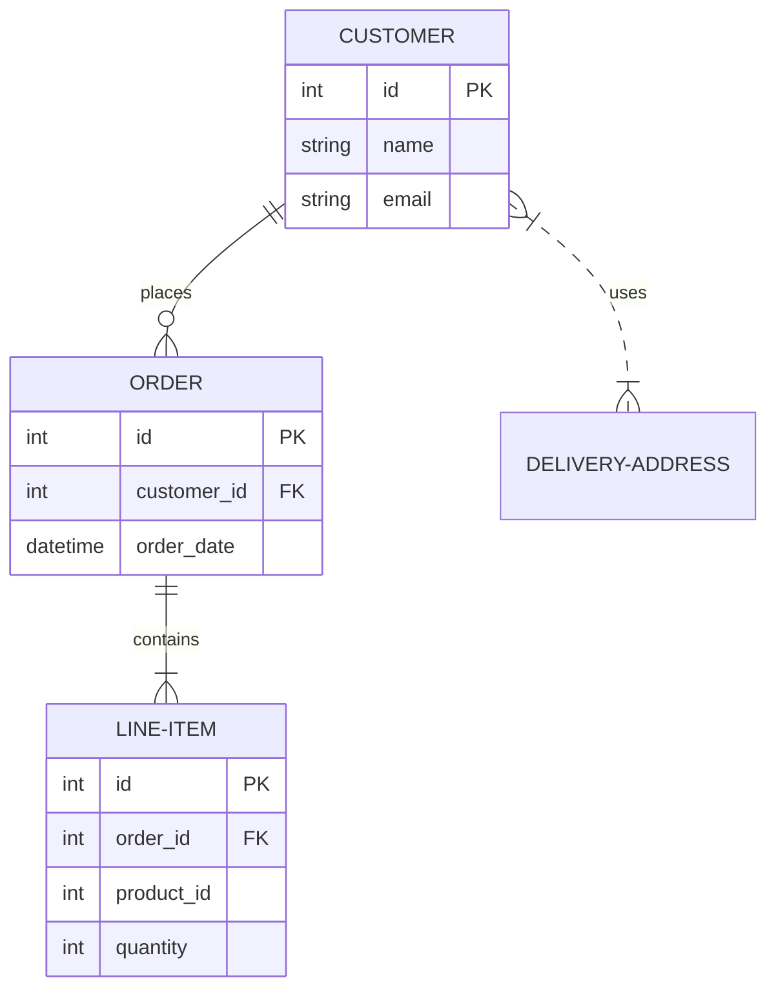

# [章番号]: データモデル設計書

!!! note "このテンプレートの使い方"

    このファイルは、システムで扱うデータの構造や、データベースのスキーマなどを定義するためのテンプレートです。
    詳しい使い方は「[設計仕様の書き方ガイド](../../00_はじめに/02_ドキュメント作成ガイド/04_設計仕様の書き方ガイド.md)」を参照してください。

## 1. はじめに

### 1.1. 目的

<!-- このドキュメントが定義するデータモデルの目的や、対象となるデータの範囲を記述します。 -->

## 2. ER図 (エンティティ関連図)



## 3. コアデータ構造 (ドメインモデル)

### 3.1. `User`

- **概要:** ユーザーを表すドメインエンティティ。
- **定義:**

```csharp
public record User
{
    public required UserId Id { get; init; }
    public required string Name { get; init; }
    public required EmailAddress Email { get; init; }
    public DateTime CreatedAt { get; }
}
```

---

## 4. テーブル定義

### 4.1. `users` テーブル

| カラム名     | データ型       | PK/FK | NULL許容 | デフォルト値 | 説明                               |
| :----------- | :------------- | :---- | :------- | :----------- | :--------------------------------- |
| `id`         | `VARCHAR(255)` | PK    | No       |              | ユーザーの一意なID。               |
| `name`       | `VARCHAR(255)` |       | No       |              | ユーザー名。                       |
| `email`      | `VARCHAR(255)` |       | No       |              | メールアドレス。UNIQUE制約を付与。 |
| `created_at` | `TIMESTAMPZ`   |       | No       | `NOW()`      | 作成日時。                         |
| `updated_at` | `TIMESTAMPZ`   |       | No       | `NOW()`      | 更新日時。                         |

### 4.2. `posts` テーブル

| カラム名     | データ型       | PK/FK           | NULL許容 | デフォルト値 | 説明                         |
| :----------- | :------------- | :-------------- | :------- | :----------- | :--------------------------- |
| `id`         | `BIGSERIAL`    | PK              | No       |              | 投稿ID。自動インクリメント。 |
| `user_id`    | `VARCHAR(255)` | FK (`users.id`) | No       |              | 投稿者のユーザーID。         |
| `title`      | `VARCHAR(255)` |                 | No       |              | 投稿のタイトル。             |
| `content`    | `TEXT`         |                 | Yes      |              | 投稿の本文。                 |
| `created_at` | `TIMESTAMPZ`   |                 | No       | `NOW()`      | 作成日時。                   |

## 5. インデックス設計

- **`users`テーブル:**
    - `users_email_key`: `email`カラムに対するUNIQUEインデックス。
- **`posts`テーブル:**
    - `posts_user_id_idx`: `user_id`カラムに対する通常のB-Treeインデックス。

## 6. データ辞書

- **`posts.status` カラム:**
    - `draft`: 下書き
    - `published`: 公開済み
    - `archived`: アーカイブ済み
