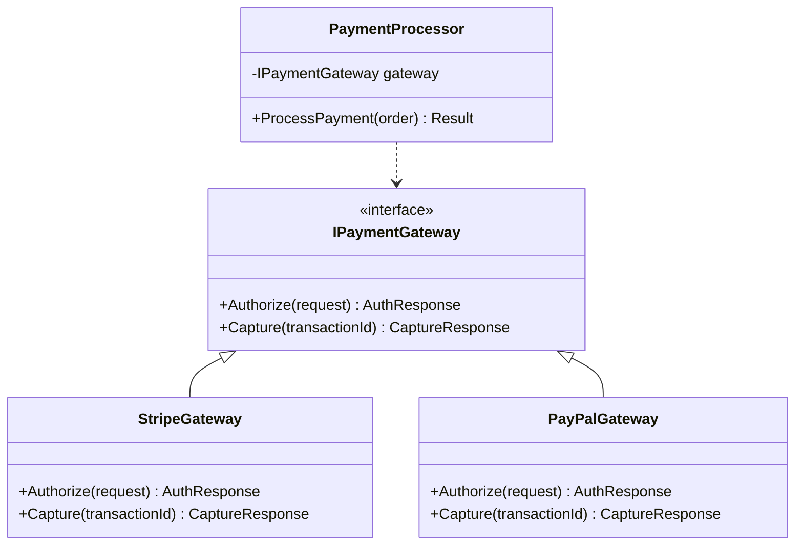
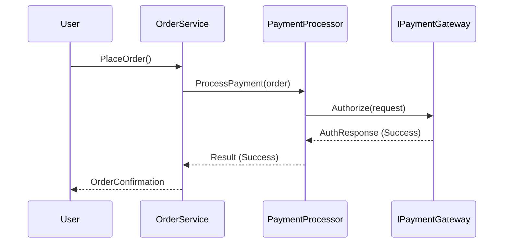
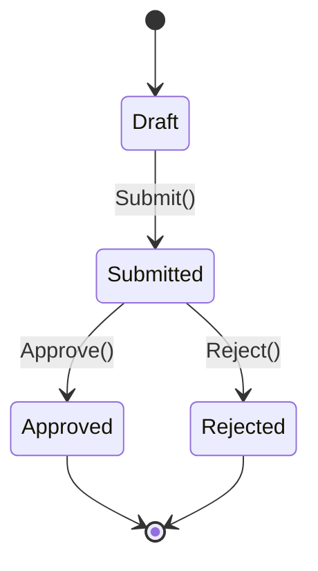

# [章番号]: [コンポーネント名] 設計書

!!! note "このテンプレートの使い方"

    このファイルは、特定のコンポーネントやモジュールの詳細な内部設計を定義するためのテンプレートです。
    複雑なビジネスロジックやアルゴリズムを実装する前に、このドキュメントで設計を明確にすることを推奨します。
    詳しい使い方は「[設計仕様の書き方ガイド](../../00_はじめに/02_ドキュメント作成ガイド/04_設計仕様の書き方ガイド.md)」を参照してください。

## 1. はじめに

### 1.1. 目的

### 1.2. 背景

## 2. コンポーネントの役割と責務

- **[責務1]:** [説明]
- **[責務2]:** [説明]

## 3. クラス図 / モジュール構成図

## 4. シーケンス図 / フローチャート

## 5. 主要なアルゴリズムやビジネスロジック

### 5.1. [アルゴリズム名]

- **目的:** ...
- **ロジック:**
    1. ...
    2. ...

## 6. 状態遷移図

## 7. 内部API/インターフェース定義

### `IPaymentGateway` インターフェース

- **概要:** 決済ゲートウェイとの通信を抽象化する。
- **メソッド:**
    - `Task<AuthResponse> Authorize(AuthRequest request)`: 支払い承認をリクエストする。
    - ...

## 8. エラーハンドリング

- **[エラーケース1]:** 決済承認の失敗
    - **対応:** `PaymentAuthorizationFailedException` をスローし、注文ステータスを `payment_failed` に更新する。

## 9. 関連する要件

- [FUNC-PAY-1-1: 決済承認の要件](../[仕様書フォルダ]/01_システム仕様書テンプレート.md#FUNC-PAY-1-1)
- [SEC-PCI-1-0: PCI DSS準拠の要件](../[仕様書フォルダ]/01_システム仕様書テンプレート.md#SEC-PCI-1-0)
