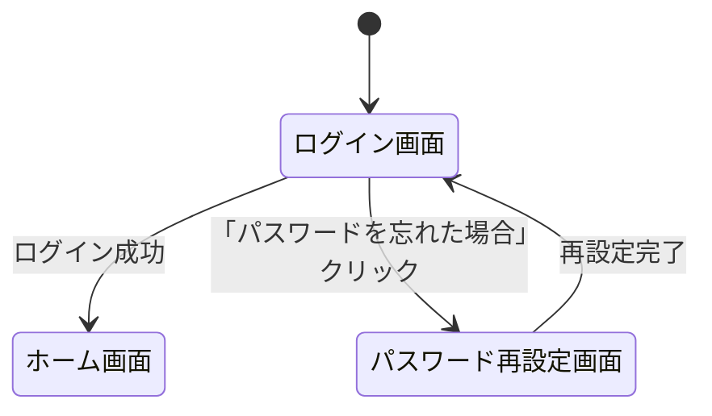

# [章番号]: [画面名/機能名] UI/UX設計書

!!! note "このテンプレートの使い方"

    このファイルは、ユーザーインターフェース（UI）とユーザー体験（UX）の設計を定義するためのテンプレートです。
    ワイヤーフレームやデザインツールへのリンクを積極的に活用し、視覚的な情報を補完することを推奨します。
    詳しい使い方は「[設計仕様の書き方ガイド](../../00_はじめに/02_ドキュメント作成ガイド/04_設計仕様の書き方ガイド.md)」を参照してください。

## 1. はじめに

### 1.1. 目的

### 1.2. 関連するユースケース

- `[UC001: ユーザーの新規登録](../02_ユースケース/...)`

## 2. デザインへのリンク

- **Figma:** [https://www.figma.com/...](https://www.figma.com/...)
- **プロトタイプ:** [https://...](https://...)

## 3. 画面設計

### 3.1. [画面名1] (例: ログイン画面)

- **概要:** ユーザーがサービスにログインするための画面。
- **画面イメージ:**

    

- **コンポーネント詳細:**

    | ID/要素                | コンポーネント種別 | 説明                                                             |
    | :--------------------- | :----------------- | :--------------------------------------------------------------- |
    | `email-input`          | テキスト入力       | メールアドレスを入力する。バリデーション: メール形式。           |
    | `password-input`       | パスワード入力     | パスワードを入力する。最小8文字。                                |
    | `login-button`         | ボタン             | クリックするとログイン処理を実行する。入力が不正な場合は非活性。 |
    | `forgot-password-link` | リンク             | パスワード再設定画面へ遷移する。                                 |

## 4. 画面遷移図

## 5. レスポンシブデザイン

- **モバイル (幅 < 768px):**
    - [レイアウトの変更点1]
    - [レイアウトの変更点2]
- **タブレット (768px <= 幅 < 1024px):**
    - [レイアウトの変更点1]

## 6. アクセシビリティ (a11y)

- **キーボード操作:** 全てのインタラクティブな要素は、キーボード（Tabキー、Enterキーなど）のみで操作可能であること。
- **スクリーンリーダー:** `aria-label`や`alt`属性を適切に設定し、スクリーンリーダーで内容が正しく読み上げられるようにすること。
- **コントラスト比:** テキストと背景のコントラスト比は、WCAG 2.1の達成基準AA（4.5:1）を満たすこと。

## 7. 関連する要件

- [UI-LOGIN-1-0: ログイン画面の要件](../[仕様書フォルダ]/01_システム仕様書テンプレート.md#UI-LOGIN-1-0)
- [FUNC-AUTH-1-1: 認証フローの要件](../[仕様書フォルダ]/01_システム仕様書テンプレート.md#FUNC-AUTH-1-1)
