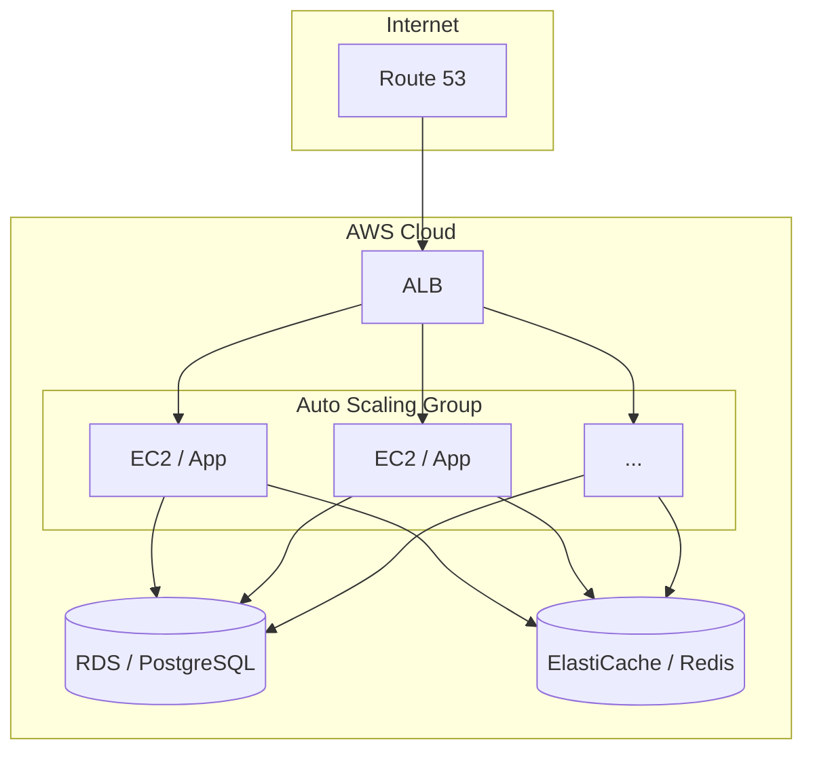
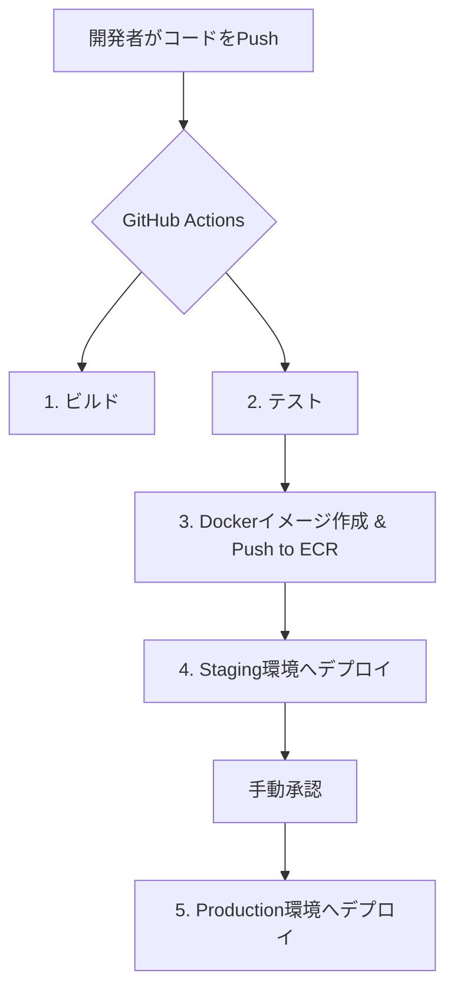

# [章番号]: インフラ・デプロイ設計書

!!! note "このテンプレートの使い方"

    このファイルは、アプリケーションを稼働させるためのインフラ構成と、CI/CDパイプラインによるデプロイ戦略を定義するためのテンプレートです。
    IaC (Infrastructure as Code) の方針や、デプロイメントフローを明確にします。
    詳しい使い方は「[設計仕様の書き方ガイド](../../00_はじめに/02_ドキュメント作成ガイド/04_設計仕様の書き方ガイド.md)」を参照してください。

## 1. はじめに

### 1.1. 目的

## 2. インフラ構成図

## 3. インフラストラクチャ管理

- **管理ツール:** Terraform
- **方針:** Infrastructure as Code (IaC) を徹底し、インフラ構成をコードで管理する。手動でのインフラ変更は原則として禁止する。

## 4. CI/CDパイプライン設計

### 4.2. 使用ツール

- **CI/CDプラットフォーム:** GitHub Actions
- **コンテナレジストリ:** Amazon ECR

## 5. デプロイ戦略

- **戦略名:** Blue/Greenデプロイメント
- **手順:**
    1. 新しいバージョン用の環境（Green）を構築。
    2. Green環境に新しいアプリケーションをデプロイ。
    3. テスト用のトラフィックをGreen環境に流し、動作確認。
    4. 問題がなければ、ロードバランサーでトラフィックを完全にGreen環境に切り替え。
    5. 旧環境（Blue）は一定期間保持し、問題発生時のロールバック先として利用する。

## 6. ロールバック手順

- **トリガー:**
    - 監視システムでのクリティカルなアラート発報。
    - スモークテストの失敗。
- **手順:**
    1. ロードバランサーのトラフィックを、即座に旧環境（Blue）に切り戻す。
    2. 問題の原因調査を開始する。

## 7. 関連する要件

- [AVAIL-GEN-1-1: 可用性要件の名称](../[仕様書フォルダ]/01_システム仕様書テンプレート.md#AVAIL-GEN-1-1)
- [EXT-GEN-1-1: 拡張性要件の名称](../[仕様書フォルダ]/01_システム仕様書テンプレート.md#EXT-GEN-1-1)
- [OPS-GEN-1-1: 運用性要件の名称](../[仕様書フォルダ]/01_システム仕様書テンプレート.md#OPS-GEN-1-1)
